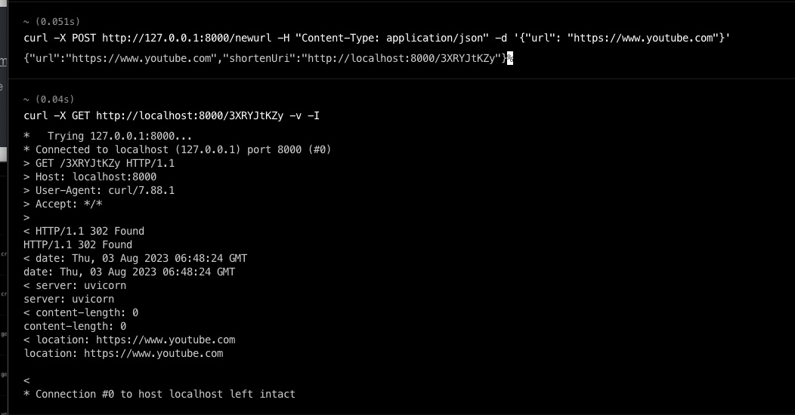

## Architecture Diagram


## How to Use?

```shell
docker compose up
```

1. **Test URL Shortening**
   - Input: POST to `/newurl` with payload: `{"url": "https://www.example.com"}`
   - Test: Check if response status code is 200. Check if response contains keys 'url' and 'shortenUri'. Verify that 'url' in the response matches the input URL and 'shortenUri' is a correctly formed URL and ends with a 9-character random string.
   
   **Result**
   
   

2. **Test URL Shortening with already shortened URL**
   
   - Input: POST to /newurl with payload: {"url": "https://www.example.com"}
   - Test: Repeat the same request. Check if response status code is 200 and the 'shortenUri' returned is same as the previous request.
   
   **Result**
   
   

3. Test URL Redirection
   - Input: POST to /newurl with payload: {"url": "https://www.example.com"}
   - Test: Copy the 'shortenUri' from the response and perform a GET request to /{shortened_url} where shortened_url is the 9-character random string at the end of 'shortenUri'. Check if response status code is 302 and 'Location' header in the response matches "https://www.example.com".
   
   **Result**
   
   

4. Test Non-Existent Shortened URL
   - Input: GET to /{shortened_url} where shortened_url is a non-existent 9-character random string.
   - Test: Check if response status code is 404 with detail "URL not found".
   
   **Result**
   
   

## HA Deployment

Here i will use minikube to simulate production Kubernetes Setup to support High availability:
*Please install Minikube before you run the script!!!*

### How to Use:

```shell
bash start_k8s.sh
```

Test the API:

POST /newurl

```shell
curl -X POST http://127.0.0.1:8080/newurl -H "Content-Type: application/json" -d '{"url": "https://www.youtube.com"}'
```

GET /{shorten_id}

```shell
curl -X GET http://localhost:8080/{shorten_id} -I -L
```

